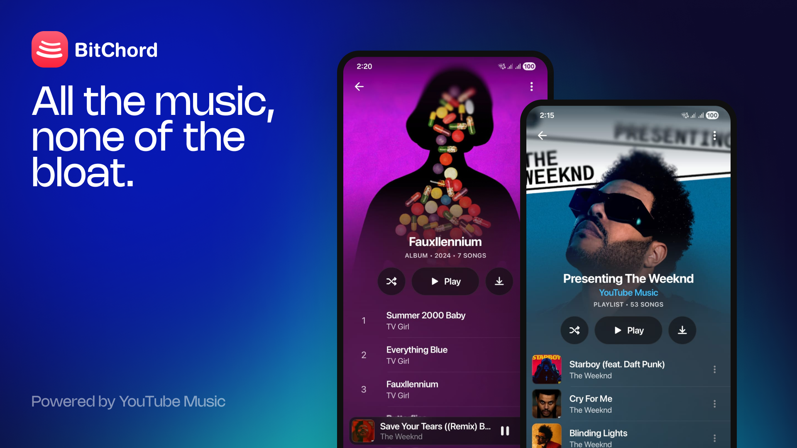

# BitChord - Aesthetic YouTube Music Client



An unofficial YouTube Music client for Android, built with Jetpack Compose. BitChord talks to YouTube Music's own web API (Innertube) directly — no official API key, no ads, no first-party app. Since v1.4 it can also pull bit-exact lossless audio from a configured module source, with YouTube Music as the automatic fallback.

> BitChord is not affiliated with, endorsed by, or connected to YouTube or Google in any way. Use it at your own discretion.

## Features

- **Search, browse and play** anything available on YouTube Music — songs, albums, artists, playlists.
- **Hi-Res lossless audio** — FLAC/ALAC from a configured module source, with YouTube Music as the automatic fallback. Playback starts on whichever stream resolves fastest and upgrades to the better one in the background once it's ready.
- **Automix [Beta]** — DJ-style transitions in place of a plain crossfade. An on-device analyzer reads tempo, beat grid, key, song structure and vocal activity, then beat-matches, tempo-stretches and phrase-aligns the mix, with bass handoff and filter sweeps. Falls back to an equal-power crossfade when a pair can't be mixed cleanly.
- **Gapless playback with true crossfade**, adjustable 0–12s — two overlapping decoders on an equal-power curve, applied to manual skips as well as track ends, powered by Media3/ExoPlayer.
- **Animated album canvas** — motion artwork on the now-playing screen, sourced from Apple Music, Tidal and community canvases, with a full-bleed mode and a still-image fallback.
- **Word-synced lyrics** — word/syllable-level highlighting from BetterLyrics, LyricsPlus, SimpMusic and LRCLIB; tap a line to seek, optional back-gesture to dismiss.
- **Discord Rich Presence** — in-app login, live track/artist/album and progress, plus configurable status text, activity type and up to two custom buttons.
- **Pluggable sources** — a Sources screen to add, edit, test and health-check module sources; JS plugins run in a sandboxed QuickJS VM with no access to the Android runtime.
- **Sign in with your Google account** — an in-app WebView runs the real `accounts.google.com` login (2FA and passkeys work as normal); only the resulting session cookies are captured, never the credential itself.
- **Offline downloads** — save tracks to `Music/BitChord` with title/artist/album/cover art embedded directly into the file, so they read correctly in a file manager or another player, not just inside BitChord.
- **Local music library** — songs, artists, albums and downloads, with artwork; anything already on the device is scanned in alongside what streams from YouTube Music.
- **Scrobbling** to **Last.fm** and **ListenBrainz**, with per-service timing/threshold controls.
- **Per-network audio quality** — separate quality ceilings for Wi-Fi and mobile data, so a lossless ceiling on Wi-Fi doesn't follow you onto a metered connection.
- **Playback speed control** (0.5×–2.0×) and **skip silence**.
- **Sleep timer** — fixed presets or "stop after this track".
- **System equalizer** integration.
- **"Stats for nerds"** — codec, bit depth, sample rate, channels and bitrate on the now-playing screen, with quality badges and an integrated queue.
- **Dynamic, artwork-driven theming** — a Material palette extracted from the current album art drives the now-playing background and backdrop washes across the app.
- **Frosted-glass UI** — Telegram-style translucent bars via Haze, Material 3 theming with light/dark/system modes.
- **Background playback** via a proper foreground media session (lock screen controls, notification, Android media controls).

## How it works

BitChord doesn't use YouTube's official Data API. Instead it:

1. Speaks to the same **Innertube** endpoints the `music.youtube.com` web client uses, via a small Ktor-based client (`data/innertube`).
2. Resolves playable audio streams with [NewPipeExtractor](https://github.com/TeamNewPipe/NewPipeExtractor), which handles YouTube's signature/`n`-parameter throttling, falling back across several player clients (including `ANDROID_MUSIC`, which sidesteps `po_token` enforcement) before the extractor is asked.
3. Authenticates by capturing the session cookies from a real Google login (see [`auth/YtMusicLoginScreen.kt`](app/src/main/java/com/music/bitchord/auth/YtMusicLoginScreen.kt)) rather than reimplementing OAuth.
4. Tags downloaded tracks itself — `download/Mp4Tagger.kt`, `download/WebmTagger.kt` and `download/FlacTagger.kt` write ID3/Vorbis-style metadata and cover art directly into the container, with no external tagging library.
5. Resolves each track across sources (`data/sources`): a module source is tried first, YouTube Music second, always in that order. Every protocol the app speaks is one you can read in this repo — a module supplies *results*, never new app behaviour.
6. Matches a source's result to the track you actually asked for with `TrackMatcher` (title, artist, album, duration and recording identity), rather than the title-only matching earlier versions used.
7. Analyses audio on-device for Automix through a native C++ analyzer over JNI (`app/src/main/cpp`) — tempo/beat tracking, mel and vocal spectrograms, resampling — with two quantised ONNX models (`beat_this_int8`, `vocals_umxhq_int8`) run by ONNX Runtime. Nothing is uploaded; results are cached in `AnalysisStore`.

## Download

Grab the latest signed APK from the [Releases](../../releases) page. Sideloading requires enabling "Install unknown apps" for whichever app you download it with.

## ☕ Support

BitChord is free and always will be — if it's earned a spot in your rotation, you can chip in here:

[](https://ko-fi.com/kushagrasinghx)
[](https://paypal.me/kuxhagrasingh)

## Tech stack

| Layer | Choice |
|---|---|
| UI | Jetpack Compose, Material 3 |
| Playback | Media3 / ExoPlayer, MediaSessionService |
| Networking | Ktor client + kotlinx.serialization |
| Stream resolution | NewPipeExtractor, plus module sources via `SourceResolver` |
| Source modules | QuickJS (`quickjs-kt`) sandbox, Convx-compatible JS plugins |
| Automix DSP | Native C++ over JNI (CMake) — beat tracking, mel/vocal spectrograms, resampling |
| ML models | ONNX Runtime (`beat_this_int8`, `vocals_umxhq_int8`), arm64-v8a + x86_64 |
| Canvas video | Media3 HLS, Apple Music / Tidal / community canvases |
| Discord | Ktor WebSocket gateway client, token in encrypted storage |
| Images | Coil 3 + Palette |
| Blur / glass effects | Haze |
| Auth storage | AndroidX Security (encrypted prefs) |
| Scrobbling | Last.fm + ListenBrainz, over the existing Ktor client |
| Downloads / tagging | Hand-rolled MP4/WebM/FLAC muxers — no external metadata library |

Minimum SDK 26, target/compile SDK 36, Kotlin, portrait-only. Native code ships for `arm64-v8a` and `x86_64` only — minSdk 26 already postdates the 64-bit requirement, so a 32-bit slice would double the native payload for devices that aren't in the install base.

## Building from source

```bash
git clone https://github.com/kushagrasinghx/BitChord.git
cd BitChord
./gradlew assembleDevDebug
```

A debug build needs no extra setup. For a signed release build, create a keystore and a `keystore.properties` (see [`keystore.properties.example`](keystore.properties.example)):

```bash
keytool -genkey -v -keystore bitchord-release.jks \
    -keyalg RSA -keysize 2048 -validity 10000 -alias bitchord
```

Then:

```bash
./gradlew assembleProdRelease
```

The APK lands in `app/build/outputs/apk/prod/release/`. Without `keystore.properties`, the release build still runs but produces an unsigned APK.

### Build flavors

There are two: `dev` and `prod`. They exist only so a build you're working on can sit installed alongside the one you actually listen to — `dev` ships under a separate application id (`com.dev.bitchord`), is labelled "BitChord Dev" in the launcher, and carries a small "Dev" badge next to the logo in the app. `prod` is the shipped package and is what releases are cut from.

The flavourless `assembleDebug` and `assembleRelease` tasks still work, but each builds *both* flavors; name the variant (`assembleDevDebug`, `assembleProdRelease`) to get one APK in one place.

## Project structure

```
app/src/main/
├── cpp/                    Native Automix analyzer (CMake + JNI)
├── assets/                 Quantised ONNX models
└── java/com/music/bitchord/
    ├── auth/               Google/YT Music sign-in
    ├── data/               Innertube client, models, settings, local media scan, scrobbling
    │   ├── canvas/         Apple Music / Tidal / community motion artwork
    │   ├── discord/        Rich Presence gateway client
    │   ├── lyrics/         LRCLIB, BetterLyrics, LyricsPlus, SimpMusic; LRC/TTML parsing
    │   └── sources/        MusicSource abstraction, registry, resolver, matcher, JS modules
    ├── download/           Download queue/service, on-disk store, MP4/WebM/FLAC tagging
    ├── playback/           Media3 service, queue, crossfade, quality upgrade, sleep timer, cache
    │   └── smart/          Automix — analysis, beat/vocal tracking, transition planning
    └── ui/                 Screens (home, search, library, local, sources, player), theming
```

## Contributing

Contributions are welcome — bug fixes, features, or cleanup. Open a PR, or open an [issue](../../issues) first for anything sizable so it can be discussed before you put work into it.

Found a bug or have a feature request? [File an issue](../../issues/new) with as much detail as you can (device, Android version, steps to reproduce, logs if you have them).

## ⚖️ Disclaimer & Legal Notice

BitChord is an independent, community-driven third-party audio player and client. It is **not** associated with Google LLC, YouTube Music, Deezer, Telegram, or any of their parent companies.

* **No Media Hosting:** BitChord does not host, upload, or store copyrighted music files. It operates strictly as an interface to scan local device storage or stream media directly from public, public-facing, or user-authenticated APIs (such as YouTube Music's InnerTube API).
* **Fair Use & API Usage:** This software is created solely for personal research, educational, and fair-use purposes. The user is entirely responsible for ensuring their usage aligns with their local copyright laws and YouTube Terms of Service.
* **No Ad-Blocking Guarantee:** While BitChord focuses on providing a clean listening environment, it does not guarantee permanent bypasses or modifications to commercial third-party platform conditions.
* **Copyleft, Not a Commercialization Ban:** BitChord is free software under the GPLv3 (see below). The license does not let anyone forbid others from selling or redistributing copies — including verbatim copies — but any distribution, commercial or not, must come with the Corresponding Source under the same license.

## 📄 License

This project is licensed under the **GNU General Public License v3.0 (GPLv3)**.

```text
Copyright (C) 2026 Kushagra Singh

This program is free software: you can redistribute it and/or modify
it under the terms of the GNU General Public License as published by
the Free Software Foundation, either version 3 of the License, or
(at your option) any later version.

This program is distributed in the hope that it will be useful,
but WITHOUT ANY WARRANTY; without even the implied warranty of
MERCHANTABILITY or FITNESS FOR A PARTICULAR PURPOSE. See the
GNU General Public License for more details.

You should have received a copy of the GNU General Public License
along with this program. If not, see <https://www.gnu.org/licenses/>.
```

To review the full license text, please check the [LICENSE](LICENSE) file.
